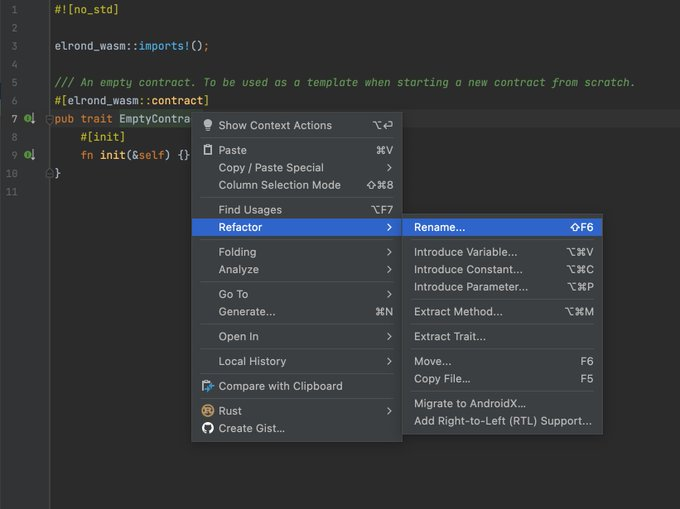

# ElrondFlip

This repository is a tutorial about building a smart contract on Elrond.

Links to tutorial :

🇫🇷 - https://twitter.com/gfusee33/status/1515011670732677132

🇺🇸 - COMING SOON


# Tutoriel en français

## INTRODUCTION : Créer une dApp de flip sur Elrond

L'application que l'on va développer ensemble est un flip : un "**quitte ou double**" où un joueur a une chance sur deux de doubler sa mise.

Ce tutoriel sera divisé en 3 parties : 
- installation des outils de dev
- développement du smart contract
- développement de l'interface web

Ce que nous allons faire :

- Coder un smart contract
- Déployer le smart contract
- Coder l'interface web et intéragir avec le contract
- Parler de quelques bonnes pratiques

Ce que nous n'allons PAS faire :

- Coder de facon optimisée, on va préférer la lisibilité pour toucher les débutants
- Faire une interface jolie, le but de ce thread est de dev
- Déployer de facon propre & sécurisée le tout (s'il y a bcp de demande on peut se faire ca en bonus)

## PARTIE 1 : Setup de l'environnement de dev

Tout d’abord il vous faudra installer **erdpy**, il s’agit d’un outil vous permettant de compiler, tester et debuguer vos smart contracts, pour l’installer suivez la doc Elrond : [Elrond doc installing erdpy](https://docs.elrond.com/sdk-and-tools/erdpy/installing-erdpy/)

Une fois l’IDE installé on va lui rajouter des plugins, pour **VSCode** il vous faudra l’extension officielle d’Elrond: [VScode Elrond extension](https://marketplace.visualstudio.com/items?itemName=Elrond.vscode-elrond-ide)

Pour **IntelliJ** on recommande le plugin Rust, pour l'installer vous allez au démarrage dans l'onglet "**Plugins**" et vous recherchez **Rust**.

On va tester l’installation rapidement en téléchargeant un contrat d’Elrond et en le compilant :

- Créez un nouveau dossier pour stocker les fichier du contract, puis ouvrez un terminal et positionnez-vous dans ce dossier avec la commande `cd <chemin du dossier>`

- Une fois dans le dossier lancez la commande `erdpy contract new adder --template adder`

- Si tout se passe bien 2 dossiers vont se créer : **adder** et **erdjs-snippets**

- Placez-vous dans le dossier adder (commande `cd adder`) et lancez la commande `erdpy contract build` qui va avoir pour effet de compiler le contrat.

- Laissez tourner, si à la fin vous voyez **WASM file generated: blablabla** alors votre installation tourne niquel et vous êtes prêts pour la partie 2 où nous allons coder le contrat.

## PARTIE 2A: Réflexions fonctionnelles

Vous avez votre environnement de prêt? Parfait car nous n'allons pas encore coder.
On va se poser calmement et faire un petit cahier des charges de ce que notre contrat fera, comment et avec quelles précautions.

On va donc développer un contrat de flip, on aimerait plusieurs choses, tout d'abord que lorsqu'un joueur mise il ait une chance sur deux de doubler (la base du jeu donc).

On souhaite aussi prendre des frais (en % de la mise) sur le montant doublé en cas de victoire.

L'argent qui va être remporté par les joueurs gagnants n'apparaît pas par magie, il faudra que nous l'alimentions nous-même

Imaginons que nous alimentions avec 5 EGLD, avec 5 flips gagnants consécutifs de 1 EGLD le contrat serait à court de liquidité.

5 flips sur 5 gagnants = 3.13% de chances (loi binomiale)

Il faut donc faire jouer la loi faible des grands nombres en jouant sur deux leviers : la quantité d'EGLD que nous allons donner au contrat et la mise maximale autorisée (on va ici mettre 10% et max 1 EGLD).

Autre chose importante on doit éviter à tout prix d'effectuer la mise d'un joueur ET la génération de l'aléatoire pour le flip dans le même bloc afin de ne pas se prendre une attaque dans la gueule.

Imaginez que le flip se fasse dans la même tx que celle où le joueur mise, il suffirait à un joueur malveillant d'avoir un clone identique de la blockchain, de tester sa tx sur ce clone et de soumettre la transaction à la vraie blockchain uniquement si le résultat est gagnant.

Pour faire simple sur Elrond les "nombres aléatoires" sont possibles contrairement à Ethereum, si on est au bloc N les nombres aléatoires des blocs N+1, N+2, etc... sont imprévisibles car ils dépendent de la signature des validateurs des blocs précédents.

Mais lorsque nous sommes au bloc N les nombres aléatoires de ce même bloc N sont prévisibles et calculables et heureusement, sinon comment prouver qu'un noeud n'est pas malveillant si on peut pas recalculer le résultat d'une transaction?

Un oracle permettrait aussi évidemment de contourner le problème mais cette solution rendrait ce thread bien trop compliqué.

On va résoudre ce problème en faisant le flip en deux transactions, la première où le joueur place sa mise et la deuxième où le flip sera réalisé.

Mais petite subtilité, n'importe qui pourra faire la deuxième transaction qui générera l'aléatoire du flip
Pour inciter d'autres utilisateurs (joueur ou non) à faire cette transaction on va les rémunérer avec % de la mise!

En clair si joueur A place 1 EGLD au bloc N, dès le bloc N-1 un utilisateur B pourra générer son flip et touchera un % de la mise de 1 EGLD
Évidemment premier arrivé premier servi afin de ne pas laisser le temps de tester sur une blockchain clonée.

## PARTIE 2B: Initialisation du projet

On va commencer par se placer avec le terminal dans le dossier où vous aller créer le projet, dans mon cas `~/Documents/Elrond` puis on va lancer la commande `erdpy contract new flip –template empty`, un nouveau dossier “**flip**” va apparaître.

Ouvrir le projet avec votre IDE.

Renommer `/flip/src/empty.rs` → `/flip/src/lib.rs` en utlisant l’outil **Refactor**


Ensuite dans notre fichier `lib.rs`, on va renommer le **EmptyContract** en **FlipContract**, pareil on va pas le faire à la main mais utiliser l’outil de refactor de notre IDE:



Maintenant on va changer la version du compilateur Elrond, on va se fixer une version afin que personne ne soit perdu, imaginez si quelqu’un lit ce thread dans 3 mois et que des mises à jour du framework ont changé la façon de coder cette personne sera complètement perdue.

J’ai choisi la version `0.30.0.` car c’est la version la plus à jour au moment où je code ce contrat

Petit update de dernière minute: la version `0.31.1` est sortie, on ne va pas l’utiliser pour ce thread mais je vous encourage évidemment à l’utiliser dans vos projets.

Pour changer la version on va dans le fichier `Cargo.toml` et on change les version d’`elrond-wasm-XXX` pour mettre la `0.30.0`.

```rust
[package]
name = "flip"
version = "0.0.0"
authors = [ "you",]
edition = "2018"
publish = false

[lib]
path = "src/lib.rs"

[dev-dependencies]
num-bigint = "0.4.2"

[dependencies.elrond-wasm]
version = "0.30.0"

[dev-dependencies.elrond-wasm-debug]
version = "0.30.0"
```

Et on fait la même modification dans les `Cargo.toml` des dossiers `wasm` et `meta`, à ce stade là si on compile avec la commande `erdpy contract build` tout devrait bien se passer.

Le projet est setup! 

## PARTIE 2C: Storage du contrat

On va créer un nouveau fichier `storage.rs` dans le dossier `src`, ouvrez le fichier et sur **Intellij** vous devriez avoir un avertissement **File is not included in module tree, [...]**, sélectionnez **Attach file to lib.rs**

On va déclarer un module `StorageModule` dans le fichier `storage.rs`, pour vulgariser on peut voir un module comme une collection de code, ça permet de ne pas avoir un fichier `lib`.rs qui fait 30000 lignes.

On écrit pour cela le code suivant dans `storage.rs`

```rust
elrond_wasm::imports!();

#[elrond_wasm::derive::module]
pub trait StorageModule {

}
```

Il faut maintenant dire à notre contrat que notre module existe (je vulgarise très fortement en disant ça), dans notre fichier `lib.rs` on le fait ainsi :

```rust
#![no_std]

mod storage;

elrond_wasm::imports!();

#[elrond_wasm::derive::contract]
pub trait FlipContract:// ContractBase +
    storage::StorageModule
{
    #[init]
    fn init(&self) {}
}
```

On va aussi avoir besoin de stocker des types plus complexes que des nombres ou des chaînes de caractères, comme l’ensemble des infos d’un flip (l’adresse du joueur, le block sur lequel le flip est initié, etc...)

On voit dans ce code par exemple qu’un Flip contient un **id, l’adresse du joueur, le token du flip**, etc... (ouais j’ai oublié de préciser mais le flip pourra se faire sur d’autres tokens que EGLD lol).

On va donc créer un fichier `struct.rs` dans lequel nous allons déclarer nos types personalisés (nos structures).
On y place le code suivant:

```rust
elrond_wasm::imports!();
elrond_wasm::derive_imports!();

#[derive(TopEncode, TopDecode, NestedEncode, NestedDecode, TypeAbi)]
pub struct Flip<M : ManagedTypeApi> {
    pub id: u64,
    pub player_address: ManagedAddress<M>,
    pub token_identifier: TokenIdentifier<M>,
    pub token_nonce: u64,
    pub amount: BigUint<M>,
    pub bounty: BigUint<M>,
    pub block_nonce: u64,
    pub minimum_block_bounty: u64
}
```

On va maintenant placer nos variables qui vont être stockées dans la blockchain (le storage).

On se place à l’intérieur de `StorageModule` dans `storage.rs` et on va y ajouter le code suivant :

```rust
#[view(getOwnerPercentFees)]
#[storage_mapper("owner_percent_fees")]
fn owner_percent_fees(&self) -> SingleValueMapper<Self::Api, u64>;

#[view(getBountyAmount)]
#[storage_mapper("bounty_percent_fees")]
fn bounty_percent_fees(&self) -> SingleValueMapper<Self::Api, u64>;
```

On a ici rajouté 2 variables qui vont déterminer :

- le % que nous allons prendre sur chaque flip
- le % que va prendre la personne qui va générer l’aléatoire (cf partie 1a)

On va appeler “bounty” l’action de gagner un % du flip en contrepartie de la génération de l’aléatoire.

Pour donner un ordre de grandeur, 100000000 = 100%, ainsi par exemple mettre `owner_percent_fees` à 5000000 c’est prendre 5% de frais.

On fait ainsi car les nombres à virgule (flottants) n’existent pas quand on dev un smart contract, diviser par 100000000 au lieu de 100 permet de faire des frais plus précis comme 1.57% par exemple.

Maintenant nous allons rajouter les variables pour limiter la mise maximale :

```rust
#[view(getMaximumBet)]
#[storage_mapper("maximum_bet")]
fn maximum_bet(
    &self,
    token_identifier: &TokenIdentifier<Self::Api>,
    token_nonce: u64
) -> SingleValueMapper<Self::Api, BigUint<Self::Api>>;

#[view(getMaximumBetPercent)]
#[storage_mapper("maximum_bet_percent")]
fn maximum_bet_percent(
    &self,
    token_identifier: &TokenIdentifier<Self::Api>,
    token_nonce: u64
) -> SingleValueMapper<Self::Api, u64>;
```

`maximum_bet` représente la mise maximale possible pour un certain token, `maximum_bet_percent` aussi mais en % (même échelle qu’au-dessus)  du nombre du token que possède le contrat.

Par exemple on met `maximum_bet` à 1 $EGLD et `maximum_bet_percent` à 10%, la mise maximale autorisée sera le + petit d’un des deux nombres suivants :

- 1 $EGLD
- 10% du nombre d’EGLD que possède le contrat

On va rajouter une variable qui détermine le nombre de blocks à attendre avant de pouvoir bounty un flip :

```rust
#[view(getMinimumBlockBounty)]
#[storage_mapper("minimum_block_bounty")]
fn minimum_block_bounty(&self) -> SingleValueMapper<Self::Api, u64>;
```

Puis une variable qui nous indique la réserve d’un token disponible pour les flips:

```rust
#[view(getTokenReserve)]
#[storage_mapper("token_reserve")]
fn token_reserve(
    &self,
    token_identifier: &TokenIdentifier<Self::Api>,
    token_nonce: u64
) -> SingleValueMapper<Self::Api, BigUint<Self::Api>>;
```

Vous allez me dire qu’on pourrait juste récupérer la balance du token pour notre contrat, et bien ça ne marcherait pas vraiment.

En effet, un flip se fait en 2 temps, la mise puis l’execution via le bounty, mais entre ces deux moments il faut bloquer l’argent afin d’avoir de quoi payer en cas de victoire du joueur, c’est à ça que sert cette variable

Intuitivement, `token_reserve = balance - token bloqués`

Et pour finir on va rajouter 3 variables concernant notre flip :

```rust
#[view(flipForId)]
#[storage_mapper("flip_for_id")]
fn flip_for_id(&self, id: u64) -> SingleValueMapper<Self::Api, Flip<Self::Api>>;

#[view(getLastFlipId)]
#[storage_mapper("last_flip_id")]
fn last_flip_id(&self) -> SingleValueMapper<Self::Api, u64>;

#[view(getLastBountyFlipId)]
#[storage_mapper("last_bounty_flip_id")]
fn last_bounty_flip_id(&self) -> SingleValueMapper<Self::Api, u64>;
```

`flip_for_id` contient les infos sur un flip (notre struct Flip déclarée un peu + haut)

Parlons rapidement des deux autres variables:

`last_flip_id` représente l’id du dernier flip fait, on fait +1 à chaque fois qu’un joueur place une mise.

`last_bounty_flip_id` représente le dernier flip pour lequel a déjà eu lieu l’exécution.

Lorsque quelqu’un va vouloir bounty, il ne va pas générer l’aléatoire pour un flip mais pour tous les flips entre `last_bounty_flip_id` et `last_flip_id` (en prenant en compte minimal_block_bounty) en one shot (et donc plusieurs rewards d’un coup).
